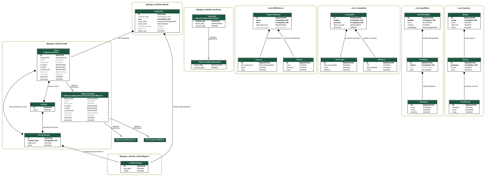

# PRIN2_Backend

Este projeto consiste em 4 aplicativos. Siga os passos abaixo para configurar o ambiente:

1. Instale o Python com o comando:

   ```bash
   sudo apt install python3
   ```

2. Instale o PDM com o comando:

   ```bash
   curl -sSL https://pdm-project.org/install-pdm.py | python3 -
   ```

3. Clone o repositório do link:

   ```bash
   git clone https://github.com/AnthonyLoche/PRIN2_Backend.git
   ```

4. Entre no diretório do projeto:

   ```bash
   cd PRIN2_Backend
   ```

5. Instale as dependências do projeto:

   ```bash
   pdm install
   ```

6. Execute a migração do banco de dados:

   ```bash
   pdm run migrate_db
   ```

7. Popule o banco de dados:

   ```bash
   pdm run populate
   ```

8. Crie um super usuario:

   ```bash
   pdm run createsuperuser
   ```

9. Execute o servidor:
   ```bash
   pdm run dev
   ```

## Documentação Dos Apps:

Para mais informações, consulte os seguintes arquivos README na pasta `docs`:

- [App de Pedidos](./docs/pedidos.md)
- [App de Consultas](./docs/consultas.md)
- [App de Turmas](./docs/turmas.md)
- [App de Biblioteca](./docs/biblioteca.md)

## Modelagem do Banco de Dados

A imagem abaixo mostra o diagrama de modelos do banco de dados utilizado neste projeto. Ele ilustra as tabelas e os relacionamentos entre elas, fornecendo uma visão geral da estrutura do banco de dados.


